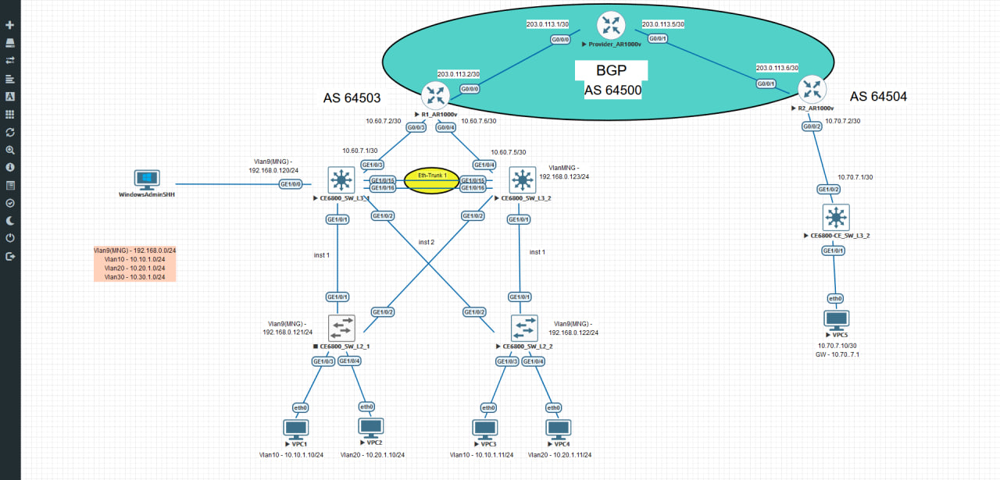

# huawei_config_proj_by_python




Конфигурация выполняется для следующих устройств:

- SW_L3_1, 
- SW_L3_2, 
- SW_L2_1, 
- SW_L2_2,
- RO_1, 
- RO_2,
- Provider_Router(условный роутер провайдера)

В рамках проекта произведена настройка следующих функций:

- VLAN
- MSTP
- VRRP
- OSPF 
- Eth-Trunk(LACP) между SW_L3_1 и SW_L3_2 
- BGP между автономными системами (64500, 64503, 64504)

> Настройка Eth-Trunk(LACP) и BGP выполнялась вручную!

## Структура репозитория

- data: Данные для кофнигурирования устройств(например это номера vlan, ip-адреса, 
					      группа и приоритет для VRRP,
					      инстансы для MSTP);

- core: Здесь описанна логика конфигурации для кадждого протокола;

- scripts: В этой диреткории лежат исполняющие скрипты;

Проект структурирован для удобства.


## Установка и настройка

1. **Клонируйте репозиторий:**
   ```bash
   git clone https://github.com/eva_095/D:\huawei_config_proj_by_python.git

2. Запуск скрипта и Установка необходимых зависимостей из requirements.txt:
	
	cd D:/huawei_config_proj_by_python
	python -m venv venv # Создание вирт окружения(Windows)
	venv\Scripts\activate # Активация вирт окружения(Windows)
	python .\scripts\01_main_vlan.py

	python3 -m venv venv # Создание вирт окружения(Linux)
	source venv/bin/activate Активация вирт окружения(Linux)
	python .\scripts\01_main_vlan.py


***Перед запуском плейбука должно быть установленно соединение с каждым устройством по ssh, 
а так же настроен vlan-управления!